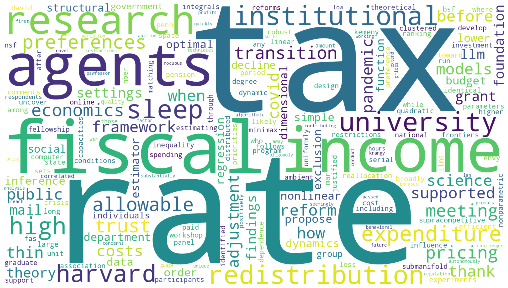
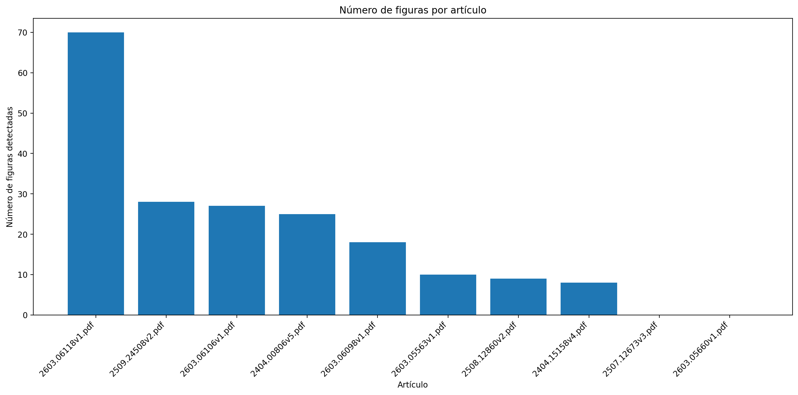

# AI Open Science Assignment

Este repositorio contiene la implementación de la práctica de la asignatura Artificial Intelligence and Open Science in Research Software Engineering.

El objetivo es analizar 10 artículos científicos de acceso abierto utilizando herramientas de análisis de texto en Python.

El programa realiza los siguiente:

1. Genera una nube de palabras a partir de los abstracts de los artículos.
2. Crea un gráfico con el número de figuras por artículo.
3. Extrae y hace un listado todos los enlaces encontrados en cada paper.

# Estructura del repositorio
ai-open-science-assignment
│
├── notebook
│ └── paper_analysis.ipynb
│
├── results
│ ├── keyword_cloud.png
│ ├── figures_per_article.png
│ ├── article_links.csv
│ ├── paper_summary.csv
│ └── validation_samples.csv
│
├── requirements.txt
└── LICENSE

# Requisitos

El proyecto requiere las siguientes librerías de Python:

pymupdf
wordcloud
pandas
matplotlib

Se proporciona en el README un acceso al notebook en Google Colab.

# Ejecución del análisis

El análisis se ejecuta mediante el notebook de Google Colab:

notebook/paper_analysis.ipynb

El notebook realiza los siguientes pasos:

1. Cargar los artículos en formato PDF.
2. Extraer el texto de cada documento.
3. Identificar el abstract de cada artículo.
4. Contar las referencias a figuras en el texto.
5. Extraer enlaces presentes en los artículos.
6. Generar las visualizaciones y archivos de resultados.

# Validación de resultados

- Se crea unos csv llamados paper_summary y validation_samples y se printean para poder ver de manera rápida si se está extrayendo bien la información.
- En validation_samples encontramos parte del abstracto de cada paper. Hubo un pdf concreto que no respeta el mismo formato para el abstract y no lo detecta ya que corta al leer "Introduction", que estaba puesto dentro del abstract.
- Se comprueban la frecuencia de las palabras manualmente en el pdf utilizando control+F para ver las instancias.
- Validamos el número de figuras manualmente comparándolo con el paper_summary. Solo se detectan figuras al encontrar patrones como "Figure N" o "Fig. N" y no de forma visual.
- Los links se contrastan con los pdf originales.

# Licencia

Este proyecto se distribuye bajo la licencia Apache 2.0.

# Ejemplos

# Keyword cloud

# Figures per article

